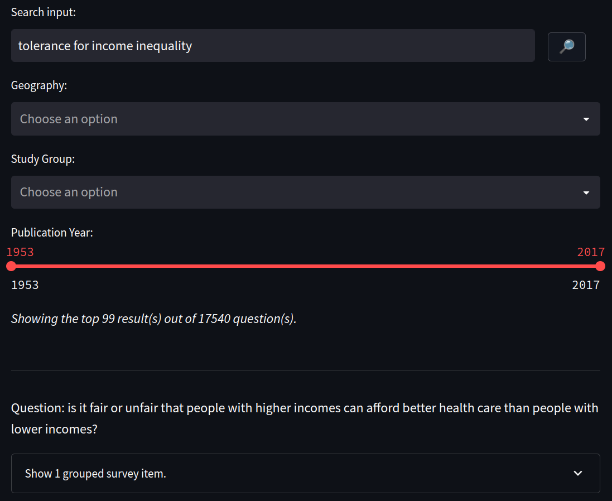

<!-- This template is adapated from https://github.com/othneildrew/Best-README-Template -->

[![Issues][issues-shield]][issues-url]

<!-- PROJECT LOGO -->
<br />
<div align="center">
  <h3 align="center">Variable Search</h3>

  <p align="center">
    A hybrid lexical & semantic search system for survey items.
    <br />
    <br />
    <a href="https://demo-vadis.gesis.org/variable_search/">View Demo</a>
    ·
    <a href="https://github.com/vadis-project/variable-search-demo/issues/new?labels=bug&template=bug-report---.md">Report Bug</a>
    ·
    <a href="https://github.com/vadis-project/variable-search-demo/issues/new?labels=enhancement&template=feature-request---.md">Request Feature</a>
  </p>
</div>

<!-- TABLE OF CONTENTS -->
<details>
  <summary>Table of Contents</summary>
  <ol>
    <li>
      <a href="#about-the-project">About The Project</a>
    </li>
    <li>
      <a href="#getting-started">Getting Started</a>
      <ul>
        <li><a href="#prerequisites">Prerequisites</a></li>
        <li><a href="#installation">Installation</a></li>
      </ul>
    </li>
    <li><a href="#usage">Usage</a></li>
    <li><a href="#license">License</a></li>
    <li><a href="#contact">Contact</a></li>
  </ol>
</details>

<!-- ABOUT THE PROJECT -->
## About The Project

<div align="center">
  <a href="https://demo-vadis.gesis.org/variable_search/">
     
  </a>
</div>

This project implements a multilingual, hybrid lexical & semantic search system for over 80,000 survey items (i.e., variables) from surveys such as Eurobarometer, ISSP, EVS, and more.

<!-- GETTING STARTED -->
## Getting Started

After installing dependencies and running the web app, you can immediately use it by navigating to [http://localhost:8000](http://localhost:8000).

### Prerequisites

* Install [python](https://www.python.org/downloads/)
* Install [JDK](https://www.oracle.com/java/technologies/downloads/)

### Installation

1. Clone the repo
   ```sh
   git clone https://github.com/vadis-project/variable-search-demo.git
   ```
2. Create and activate a virtual environment
   ```sh
   python3 -m venv venv
   source /venv/bin/activate
   ```
3. Install python packages
   ```sh
   pip install -r requirements.txt
   ```

<!-- USAGE EXAMPLES -->
## Usage

Run the application on a specified port (e.g., port 8000) and navigate to [http://localhost:8000](http://localhost:8000):
```sh
  streamlit run app.py --server.port 8080
```

You can configure additional settings in `config.py`.

<!-- LICENSE -->
## License

MIT license. See `LICENSE` for more information.

<!-- CONTACT -->
## Contact

Tornike Tsereteli - tornike.tsereteli@uni-mannheim.com


<!-- MARKDOWN LINKS & IMAGES -->
<!-- https://www.markdownguide.org/basic-syntax/#reference-style-links -->
[issues-shield]: https://img.shields.io/github/issues/vadis-project/variable-search-demo.svg?style=for-the-badge
[issues-url]: https://github.com/vadis-project/variable-search-demo/issues
[license-shield]: https://img.shields.io/github/license/vadis-project/variable-search-demo.svg?style=for-the-badge
[license-url]: https://github.com/vadis-project/variable-search-demo/blob/master/LICENSE
[product-screenshot]: images/screenshot.png
